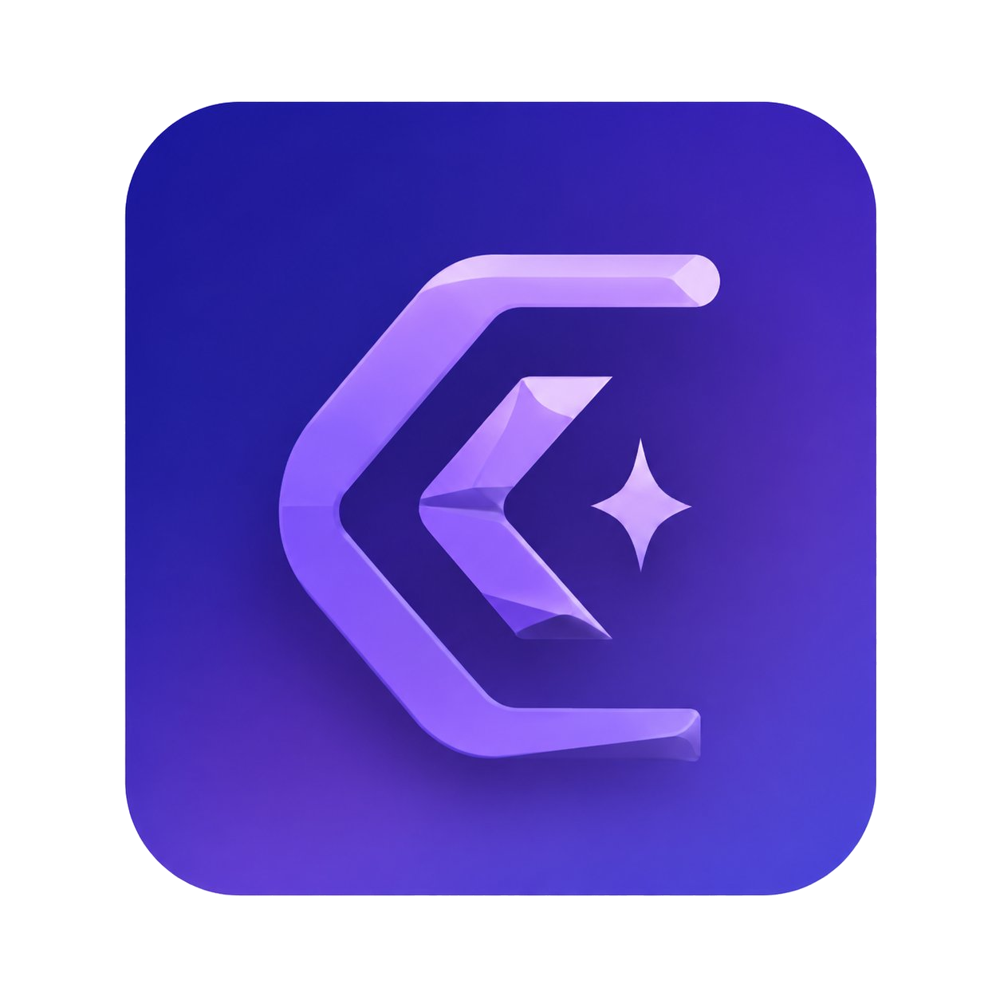

<div align="center">

<h1>Clack</h1>

<p><strong>Local-first IDE, terminal, and agent workspace.</strong></p>

<p>


</p>
</div>

Clack is a lightweight open-source IDE, terminal, and agent workspace that allows developers to edit code, work with real shells, manage projects, and more with optional AI assistance.

Built with Tauri 2, Rust, React 19, TypeScript, Vite, xterm.js, CodeMirror 6, Tailwind CSS v4, shadcn/ui, Zustand, and the Vercel AI SDK, Clack features a native PTY backend and a WebGL-rendered terminal with docked terminal tabs, split panes, a code editor, file explorer, source control, git history, web preview, themes, background images, and support for bring-your-own-key providers.

No telemetry is collected from users. There is no need to create an account. Your workspace stays with you.

Screenshots

<table>
<tr>
<td align="center"><br/><sub>Docked terminal with tabs, splits, and WebGL rendering</sub></td>
<td align="center"><br/><sub>Themes, presets, and background images</sub></td>
</tr>
<tr>
<td align="center"><br/><sub>Preview local dev servers and external URLs</sub></td>
<td align="center"><br/><sub>Git status, diffs, commits, branches, and history</sub></td>
</tr>
<tr>
<td colspan="2" align="center"><br/><sub>Optional agent workflow with file context and edit diffs</sub></td>
</tr>
</table>

Features

Terminal

Clack’s terminal is built with a native PTY backend with support for zsh, bash, pwsh, PowerShell, fish, cmd, and WSL shells. The xterm.js terminal can render in WebGL mode with support for true-color terminals, links, search, scrollback, tabs, and split panes. Its docked terminal layout keeps developers in the editor and their terminal in view at all times. Each workspace has its own terminal environments for local projects and Windows WSL distributions.

### Workspace

- Editor with language modes and [Vim support](https://github.com/vim/vim)
- File explorer with icons, fuzzy search, keyboard navigation, inline rename, context actions
- Source control
- Web preview
- Custom themes, editor themes, presets, background images

### Optional AI

- [BYOK providers](https://github.com/ethersphere/ethersphere/issues/3): OpenAI, Anthropic, Google, Groq, xAI, Cerebras, OpenAI-compatible
- [Local providers](https://github.com/ethersphere/ethersphere/issues/2): LM Studio, MLX, Ollama
- Planning, approval of tools, edit diffs, background processes, snippets, file attachments, project memory, voice input
- API keys stored via the OS keychain via [@keyring](https://www.npmjs.com/package/keyring), not localStorage

## Install

The release channels are not yet configured. Install via:

```bash
npm install

npm run tauri dev

npm run tauri -- build
```

For a Windows installer:

```bash
npm run tauri -- build --bundles nsis
```

On the first run, Windows may show a message that says “Windows protected your PC” because Clack is not yet code-signed. Click “More info” then “Run anyway”.

## Configure Providers

Go to Settings -> AI and select one of the available providers. Add the API key for the provider if required. For private or offline setups, configure Clack to use [LM Studio](https://lmstudio.ai/), [MLX](https://mlx.ai/), or [Ollama](https://ollama.ai/).

## Checks

```bash
npm run check-types

npm run lint

npm test
```

```bash
cd src-tauri

cargo fmt --check

cargo clippy --all-targets --locked -- -D warnings

cargo test --locked

cd ..
```

## Project Memory

The agent remembers information about the project in the `CLACK.md` file.

## Contributing

All types of contributions are welcome! Please run the checks above before opening a pull request.

## License

Apache-2.0 license. See [LICENSE](LICENSE).
